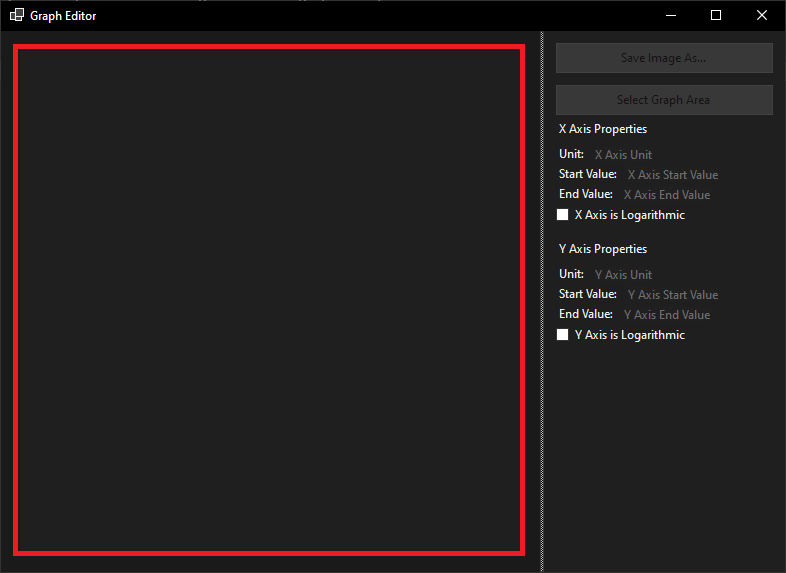
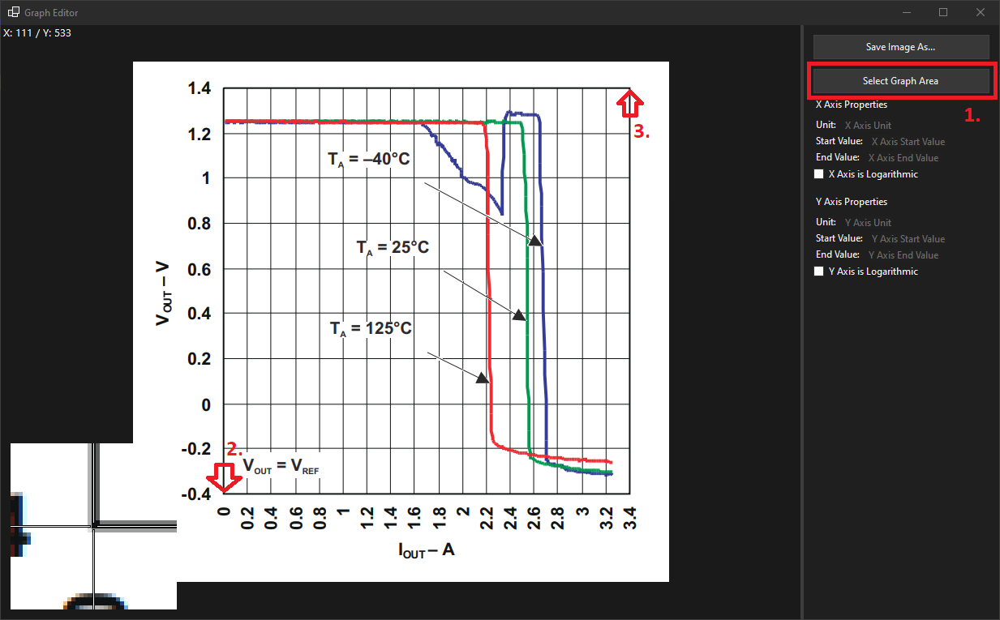
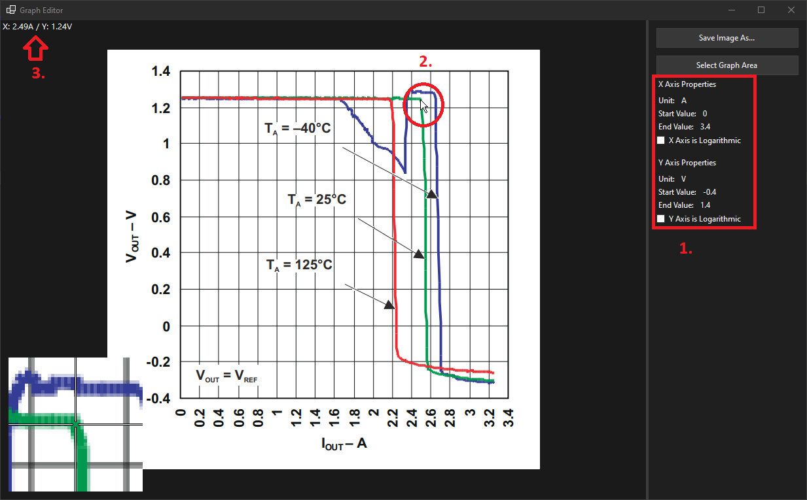

# GraphEditor

## Introduction

GraphEditor is a graph reader / editor tool that allows for easily reading out values from graphs that are only available in image format.

## Features

The following features are currently available:

- Independent configuration of either a linear or logarithmic scale for both the x and y axis.
- Zoom lens: A zoom lens appears in the bottom left corner of the GUI when hovering over an active image. The zoom lens' size can be momentarily increased by pressing the shift key.
- Active graph area selection: The active graph area can be (re-)selected by the user by pressing a button in the configuration panel and then selecting the start and end point.
- Information overlay: There is an information overlay in the top left corner of the GUI with coordinate / value display and user guidance (for example for selecting the active graph area).

## Usage Guide

1. Open an image by double-clicking the large gray field in the center of the screen as shown in the image below:

2. Select the active graph area by 1. Pressing the "Select graph area" button 2. Selecting the start point of the graph (lowest x and y values) and 3. Selecting the end point of the graph (highest x and y values) as shown in the image below (Source of the graph: [LM317 Datasheet Figure 6-2](https://www.ti.com/lit/ds/symlink/lm317.pdf)):

3. Read out values from the graph by 1. Specifying axis scales and units 2. Hovering over the desired point in the graph that is to be read out and 3. Reading out the actual value at that point in the information overlay in the top left corner as shown below:

